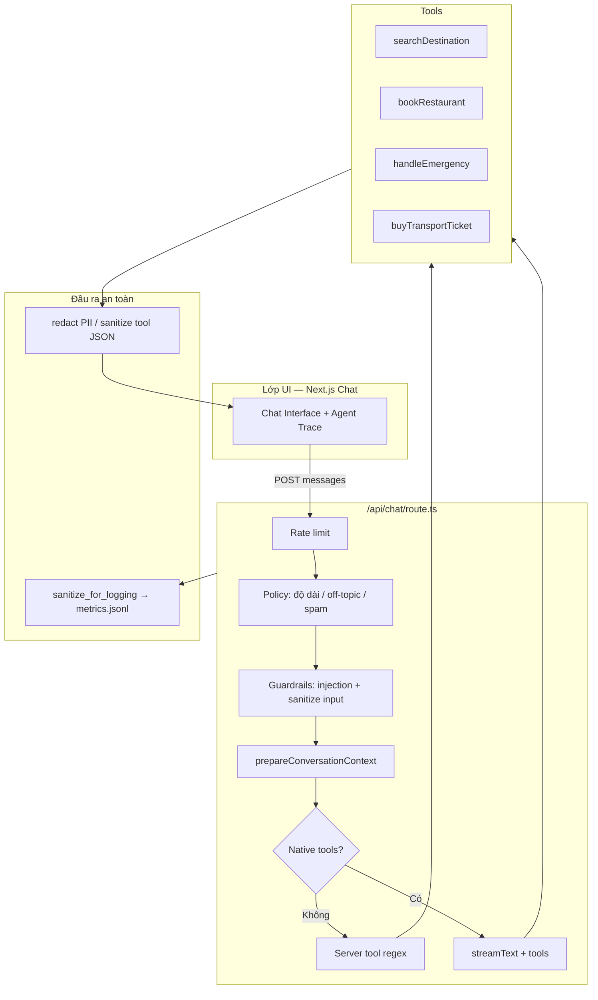
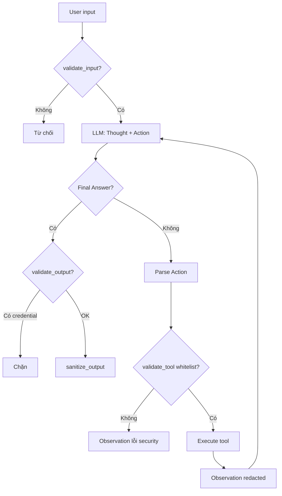

# Individual Report: Lab 3 - Chatbot vs ReAct Agent

- **Student Name**: Nguyễn Thị Bích Duyên
- **Student ID**: 2A202600752
- **Date**: 01/06/2026

---

## I. Technical Contribution (15 Points)

*Đóng góp chính: xây dựng **lớp bảo mật end-to-end** cho agent VinWonders (lịch trình, gợi ý/đặt phòng, thông báo email), đồng bộ **Python ReAct** và **Next.js chat API**.*

### Bối cảnh nghiệp vụ

Agent hỗ trợ khách du lịch tại VinWonders:

- Lập lịch trình (tham quan + ăn uống)
- Gợi ý phòng và đặt phòng (sau khi khách xác nhận)
- Gửi thông báo thay đổi lịch qua email

→ Luồng chat thu thập **email, SĐT, CCCD** → cần **guardrails**, **PII redaction**, **sanitization** trước khi ghi log hoặc đưa vào prompt tóm tắt.

### Modules đã triển khai / cập nhật

| Module | Vai trò |
|--------|---------|
| `src/security/redaction.py` | Mask PII: email, SĐT VN/quốc tế, CCCD/CMND, passport, thẻ, API key |
| `src/security/sanitization.py` | Chuẩn hóa input, gỡ control chars/script, redact log đệ quy |
| `src/security/guardrails.py` | Injection detection, tool whitelist, rate/token limits, output safety |
| `src/agent/agent.py` | ReAct loop **tích hợp guardrails** (validate → tool → redact output) |
| `src/telemetry/logger.py` | Mọi `log_event` tự qua `sanitize_for_logging` |
| `vinwonders-agent/lib/security/*` | Bản TypeScript tương ứng (`redaction`, `sanitization`) |
| `vinwonders-agent/lib/guardrails.ts` | Rate limit, validate input/output, dùng module security |
| `vinwonders-agent/app/api/chat/route.ts` | Sửa lỗi merge + rate limit + injection + sanitize tool output |
| `vinwonders-agent/lib/agent-policy.ts` | Thông báo từ chối bảo mật (tiếng Việt) |
| `vinwonders-agent/lib/logging/agent-logger.ts` | Metrics/errors không lưu PII plaintext |
| `tests/test_security.py` | Unit test redaction, sanitization, guardrails |
| `FLOWCHART_INSIGHTS.md` (repo root) | Sơ đồ luồng hệ thống, ReAct, security, memory, logging + bài học Lab 3 |

### Tài liệu kiến trúc — `FLOWCHART_INSIGHTS.md`

Em viết file **`FLOWCHART_INSIGHTS.md`** ở thư mục gốc repo để mô tả **toàn bộ luồng VinWonders Agent** (ASCII flowchart) phục vụ báo cáo và onboarding. Nội dung gồm 6 phần:

1. Kiến trúc cấp cao (UI → API Gateway → Agent routing → Tools → Streaming → Observability)
2. Vòng lặp ReAct (Python backend)
3. Luồng Security & Guardrails
4. Quản lý context window & session memory
5. Luồng logging & metrics
6. Kết luận & key takeaways (Chatbot vs ReAct, intent > prompt dài, memory, guardrails)

Bản tóm tắt có **lớp security** đã triển khai thực tế (rate limit, PII redaction) — bổ sung so với sơ đồ gốc trong file:



**ReAct Python** (`src/agent/agent.py`) — khớp mục 2 trong `FLOWCHART_INSIGHTS.md`, thêm bước validate trước/sau tool:



### Code highlights

#### 1. PII redaction (Python) — phù hợp bối cảnh VN

```python
# src/security/redaction.py
PII_PATTERNS = [
    ("email", re.compile(r"\b[A-Za-z0-9._%+-]+@...\b"), REDACT_EMAIL),
    ("phone_vn", re.compile(r"(?<!\d)(?:\+?84|0)(?:[\s.-]?)(?:3|5|7|8|9)..."), REDACT_PHONE),
    ("cccd", re.compile(r"\b\d{12}\b"), REDACT_VN_ID),
    # ...
]

def redact_pii(text: str) -> str:
    result = text
    for _name, pattern, replacement in PII_PATTERNS:
        result = pattern.sub(replacement, result)
    return result
```

**Tương tác ReAct**: observation từ tool (đặt bàn, booking) có thể chứa SĐT/email → `_execute_tool` gọi `validator.sanitize_output()` trước khi append vào prompt vòng sau.

#### 2. ReAct agent có guardrails

```python
# src/agent/agent.py
def run(self, user_input: str, user_id: Optional[str] = None) -> str:
    if not self.validator.validate_input(user_input, uid):
        return INPUT_REJECTED_MSG

    # ... vòng lặp Thought / Action / Observation ...

    if "Final Answer:" in result:
        if not self.validator.validate_output(final_answer):
            return OUTPUT_BLOCKED_MSG
        return self.validator.sanitize_output(final_answer)

    is_valid, error_msg = self.validator.validate_tool(
        tool_name, args or "", available_tools=self._allowed_tool_names()
    )
```

**Luồng**: Input → whitelist tool → observation redacted → Final Answer không lộ password/API key.

#### 3. Chat API (Next.js) — nhiều lớp policy + security

```typescript
// vinwonders-agent/app/api/chat/route.ts
if (!validator.checkRateLimit(userId, clientIp)) {
  return Response.json({ error: SECURITY_RATE_LIMIT_REPLY }, { status: 429 });
}

if (!validator.validateInput(lastUserText, userId)) {
  return createPolicyStreamResponse(messages, SECURITY_INPUT_REJECTED_REPLY);
}

const safeOutput = sanitizeToolOutputJson(output);
system: `... Kết quả công cụ "${name}": ${safeOutput}.`
```

**Tương tác với “ReAct” trên web**: không phải block `Thought` text, mà **server tool** (regex intent) + **LLM tóm tắt**; security chặn injection/rate limit và **không đưa PII thô** vào system string sau tool.

### Kiến trúc 8 lớp bảo mật (đã áp dụng)

```
User → Rate limit → Policy (độ dài, off-topic)
     → Guardrails (injection, dangerous fragment)
     → Agent / Tools
     → Output redaction → Response
     → Logs (sanitize_for_logging)
```

Tài liệu tham chiếu trong repo:

- **`FLOWCHART_INSIGHTS.md`** — sơ đồ & insight tổng thể (phần em tự viết)
- `SECURITY.md`, `SECURITY_IMPLEMENTATION_SUMMARY.md`
- `secure_agent_example.py`, `secure_route_example.ts`

---

## II. Debugging Case Study (10 Points)

### Case A — `route.ts` hỏng sau merge (API không build)

**Mô tả vấn đề**

- File `vinwonders-agent/app/api/chat/route.ts` có **đoạn code trùng lặp** (hai khối `streamText`, thiếu `}`), `buildAgentTools()` lỗi cú pháp (`execute` thừa sau `handleEmergency`).
- Triệu chứng: Next.js không compile route chat; agent web không chạy được dù Python agent vẫn ổn.

**Nguồn log / bằng chứng**

```text
# npx tsc — ví dụ lỗi
app/api/chat/route.ts(97,5): error TS1005: '}' expected.
app/api/chat/route.ts(288,7): Expression expected.
```

**Chẩn đoán**

1. So sánh `git show 04004b6:.../route.ts` (bản ổn) với HEAD → phát hiện merge conflict chưa resolve.
2. Khối `createUIMessageStreamResponse` bị cắt giữa chừng; `evaluateToolGuard` nằm sai vị trí (sau khi đã `return` stream).
3. Nguyên nhân gốc: merge nhánh tool transport + policy layer không reconcile thủ công.

**Giải pháp**

- Khôi phục cấu trúc từ commit ổn định (`04004b6`).
- Thêm lại `buyTransportTicket` và **tích hợp security** (rate limit, `validateInput`, `sanitizeToolOutputJson`) trong một luồng duy nhất.
- Đặt `evaluateToolGuard` **trước** `runServerTool`, không sau `return`.

**Kết quả**: Route compile; luồng chat = policy → security → server tool → stream tóm tắt.

---

### Case B — PII lọt vào log khi khách đặt phòng / để lại email

**Mô tả vấn đề**

- `AGENT_START` / `TOOL_CALL` ghi nguyên `user_input` hoặc observation có `0912345678`, `khach@email.com`.
- Rủi ro: file `logs/*.log`, `metrics.jsonl` lưu dữ liệu cá nhân — không phù hợp kịch bản “gửi email thông báo lịch”.

**Chẩn đoán**

- Logger và `previewUserMessage` chưa redact.
- Prompt tóm tắt sau tool dùng `JSON.stringify(output)` thô.

**Giải pháp**

```python
# src/telemetry/logger.py
safe_data = sanitize_for_logging(data)
```

```typescript
// lib/logging/agent-logger.ts
const record = { type: 'metrics', ...(sanitizeForLogging(entry) as ...) };
```

```typescript
const safeOutput = sanitizeToolOutputJson(output);
```

**Kiểm tra**

```bash
python3 -c "from tests.test_security import test_redact_vn_phone_and_email; test_redact_vn_phone_and_email(); print('OK')"
```

---

## III. Personal Insights: Chatbot vs ReAct (10 Points)

*Góc nhìn sau khi vừa làm agent vừa làm security.*

### 1. Agent cần “Thought” rõ ràng — và cả lớp bảo vệ rõ ràng

**Chatbot đơn giản**

- Một lượt LLM → trả lời; attack surface nhỏ hơn (chủ yếu prompt injection trên input).
- Dễ “nói đẹp” nhưng **không tạo ticket / không đặt bàn thật**.

**ReAct / tool-agent (VinWonders)**

- Nhiều bước: suy luận → gọi tool → observation → trả lời.
- **Thought** (hoặc routing tương đương) giúp tách: khẩn cấp trước, gợi ý sau.
- Nhưng mỗi observation có thể chứa PII từ mock booking → agent **kém hơn chatbot** nếu không redact/log-safe.

| Khía cạnh | Chatbot | ReAct / Tool agent |
|-----------|---------|-------------------|
| Suy luận đa bước | Hạn chế | Mạnh (Thought / server tool) |
| Hành động thật (ticket, đặt bàn) | Không | Có |
| Rò rỉ PII qua log/prompt | Thấp hơn | Cao hơn nếu thiếu sanitization |
| Prompt injection | Có | Có + **tool misuse** (args nguy hiểm) |

### 2. Độ tin cậy — khi nào agent “tệ hơn” chatbot?

- **Model nhỏ (qwen2:1.5b)** không parse `Action:` → vòng lặp vô ích (xem template lab / log `AGENT_TIMEOUT`). Chatbot một shot đôi khi ổn hơn.
- **Câu off-topic** trước policy: agent gọi nhầm `searchDestination` (ví dụ tin thế giới → gợi ý y tế). Đã xử lý bằng `isClearlyOffTopic` + security input.
- **Câu hợp lệ có PII** (“đặt phòng, email abc@test.com”): chatbot có thể nhắc lại email; agent + tool **phải** redact khi ghi log, vẫn cho phép nghiệp vụ qua validator.

### 3. Observation và security

Observation là feedback cho bước tiếp theo — đồng thời là **vector rò rỉ dữ liệu**. Thực hành lab:

- Sanitize observation trước khi đưa vào `current_prompt` (Python) hoặc system string tóm tắt (TS).
- Không log plaintext PII; dùng hash/input_length trong security events.

**Kết luận cá nhân**: ReAct phù hợp VinWonders (đa tác vụ, ưu tiên khẩn cấp); chatbot phù hợp FAQ đơn giản. **Security không phải phụ lục** — phải thiết kế cùng loop ngay từ đầu.

### 4. Insight từ `FLOWCHART_INSIGHTS.md` (tóm tắt)

| Chủ đề | Chatbot | Agent VinWonders (lab) |
|--------|---------|------------------------|
| Multi-step (mất ví + mưa + gợi ý) | Gộp chung, dễ lan man | Tách bước: emergency → search → trả lời |
| Định tuyến | Chỉ prompt | **Intent regex** + native tools (model lớn) |
| Token / chi phí | Tăng nếu nhồi history | **Sliding window** (~6 lượt, ~2800 token) + memory summary |
| Debug | Khó | **Structured log** + Agent Trace UI |
| Tin cậy | Ổn với FAQ | Cần **guardrails**; 30 dòng rule > 500 dòng prompt |

Trích từ mục 6 file flowchart — điểm em đồng ý sau khi implement:

- **Intent > prompt engineering**: phần lớn lỗi đến từ ý định không rõ; `detectServerTool` + policy giải quyết trước khi gọi LLM.
- **Memory**: cắt tỉa thông minh + session facts tốt hơn gửi full history (phù hợp chat dài khi đặt phòng nhiều bước).
- **Logging = debugging**: `metrics.jsonl`, event `policy_*` / `SECURITY_*` giúp chứng minh Case A/B ở mục II.

---

## IV. Future Improvements (5 Points)

### Scalability

- Rate limit in-memory → **Redis** (shared giữa nhiều instance Next.js).
- Hàng đợi gửi email thông báo lịch (Bull/SQS) tách khỏi request chat.

### Safety (ưu tiên cao cho production VinWonders)

- **Supervisor** hoặc rules engine trước `bookRestaurant` / gửi email thật (hiện demo).
- Mã hóa PII at-rest cho booking; redaction chỉ là lớp hiển thị/log.
- Allowlist model + WAF trước Ollama; không expose API ra internet.
- Mở rộng test security (pytest CI) + audit định kỳ `metrics.jsonl`.

### Performance

- Template tóm tắt sau tool thay vì gọi LLM khi output đã structured.
- Cache kết quả `searchDestination`; giảm token prompt security (ví dụ chỉ gửi hash observation).

### Observability

- Dashboard từ `logs/improvement-rollup.json` + event `SECURITY_*`: injection attempts, rate limit, tool reject.
- Cảnh báo khi `policy_security_input` tăng đột biến.

---

## Tổng kết

Trong Lab 3, em có hai đầu ra bổ sung cho codebase:

1. **`FLOWCHART_INSIGHTS.md`** — mô tả kiến trúc, luồng ReAct, security, memory, logging và so sánh Chatbot vs Agent (tài liệu thiết kế + học tập).
2. **Security stack thực thi** — `redaction` / `sanitization` / `guardrails`, tích hợp **ReAct Python** + **chat API**, sửa **route.ts**, log an toàn cho kịch bản đặt phòng & email lịch trình.

Hệ thống vừa **hành động** được (tool, observation, memory), vừa **giảm rủi ro** injection, tool misuse và lộ PII — khớp yêu cầu agent du lịch VinWonders trong đề bài lab.

---

## Phụ lục — Cấu trúc `FLOWCHART_INSIGHTS.md`

| Mục | Nội dung chính |
|-----|----------------|
| §1 | UI → API → routing (native tools / server fallback) → tools → stream → observability |
| §2 | Vòng ReAct: Thought → Action → Observation → Final Answer (Python) |
| §3 | Security: intent → whitelist tool → sanitize → guardrails → log `SECURITY_*` |
| §4 | Context window 6 lượt, ~2800 token, session facts, HTTP headers ngữ cảnh |
| §5 | Events: `AGENT_START`, `AGENT_STEP`, metrics, `metrics.jsonl` |
| §6 | Takeaways: ReAct multi-step, intent routing, memory, logging, guardrails > prompt dài |

*(Chi tiết ASCII diagram: xem file gốc tại repo root.)*

---

> **Nộp bài**
>
> - Báo cáo: đổi tên file này thành `REPORT_NguyenThiBichDuyen.md` (hoặc tên tương ứng) trong `report/individual_reports/`.
> - Đính kèm / trỏ link: **`FLOWCHART_INSIGHTS.md`** (cùng repository) làm tài liệu sơ đồ bổ sung.
